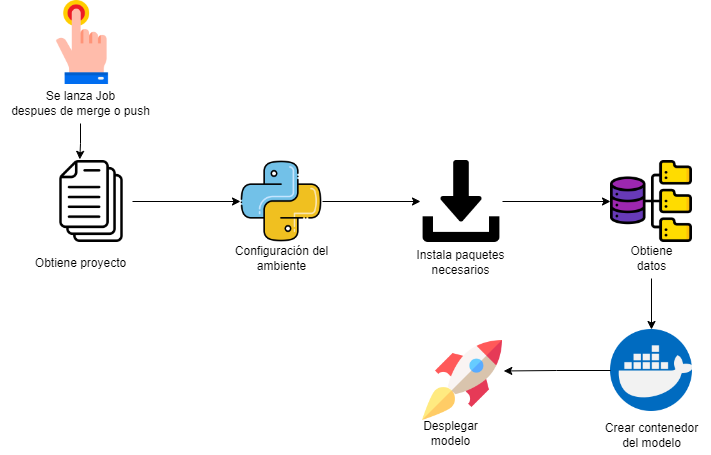

# Predicción de plagas con regresión logística

## Razón
En un equipo de científico de datos, es común que se intente continuamente encontrar el mejor modelo existente en producción, pero para lograrlo hay que verificar que el servicio no falle cuando el nuevo modelo sea desplegado.

Este proyecto demuestra el uso de DagsHub, MLFlow y GitHub Actions para:

- Realizar pruebas automáticas cuando un miembro del equipo realice un pull request.
- Mezclar(merge) un pull request cuando todas las pruebas han pasado.
- Desplegar el modelo ML en una API y una aplicación.

# Este es el resumen del flujo de trabajo:

## Experimentación con DagsHub y MLFlow
Después de probar diferentes parámetros usando [DagsHub](https://towardsdatascience.com/dagshub-a-github-supplement-for-data-scientists-and-ml-engineers-9ecaf49cc505) y [MLFlow](https://mlflow.org/docs/latest/python_api/index.html), se seleccionan una combinación de parámetros que nos dé un mejor desempeño que el modelo existente en producción, y se envía el codigo por Git.

## Usar GitHub Actions para probar el modelo y aplicación por PR
El primer flujo de trabajo [validate_model.yaml](https://dagshub.com/juferoto/mlops_project/src/master/.github/workflows/validate_model.yaml) automáticamente prueba un nuevo pull request, el cual únicamente puede ser mezclado (merged) cuando todas las pruebas hayan pasado. En caso de falla se envía una notificación vía correo electrónico al científico de datos designado para el proyecto valide porque el modelo no fue desplegado correctamente.

## Usar GitHub Actions que lanza tarea automática para probar el modelo y aplicación
El segundo flujo de trabajo [validate_model_automatically.yaml](https://dagshub.com/juferoto/mlops_project/src/master/.github/workflows/validate_model_automatically.yml) cada día automáticamente a las 11 p.m. realiza una validación al modelo y la aplicación, de lo consolidado en la rama principal (master). En caso de falla se envía una notificación vía correo electrónico al científico de datos designado para el proyecto valide porque el modelo no fue desplegado correctamente.

## Usar GitHub Actions para desplegar la API y aplicación después de mezclar
El tercer flujo de trabajo [validate_deploy_app.yaml](https://dagshub.com/juferoto/mlops_project/src/master/.github/workflows/validate_deploy_app.yaml) automáticamente despliega la API y la aplicación con el nuevo modelo seleccionado después de que el pull request es mezclado o se realiza un push directo a la rama principal (master).

# Estructura de carpetas del proyecto

- **.github:**
    - **workflows:** Almacén de los archivos de extensión Yaml, que realizan las tareas automatizadas.
- **application:** 
    - **src:** Códigos de la API con FastAPI.
        - **webapp:** Códigos de la Aplicación con Streamlit.
- **config:** Archivos de configuración.
- **data:** Almacén de datos (**raw** - datos sin procesar, **processed** - datos procesados)
- **models:** Almacén de modelos ya entrenados.
- **notebooks:** Almacén de notebooks para analizar visualmente los resultados.
- **outputs:** Guarda las configuraciones que se tuvieron por cada ejecución de un modelo.
- **training:**
    - **src:** Códigos de Python para el desarrollo del modelo.
    - **test:** Códigos de prueba para el modelo.  

# Comandos básicos para crear un modelo

## Para crear un modelo debes ubicarte en la carpeta raiz del proyecto y ejecutar el comando

Si no hay cambio en los datos se usa el siguiente comando:
`python training\src\main.py`

Por el contrario, si tienes cambios en los datos se ejecuta el siguiente comando de DVC para generar el modelo, y el flujo de datos (sin la necesidad de agregar los datos cambiados):
`dvc repro`

# Comandos básicos de DVC

- Iniciar un proyecto en DVC
    `dvc init`

- Colocar una rama por defecto para indicar en donde se almacenan los datos
    `dvc remote default origin`

- Mirar el estado de los datos tanto en local como en remoto
    `dvc status --cloud`

- Validar los estados a realizar sobre los datos
    `dvc dag`

- Para hacer un commit de los cambios
    `dvc commit -m ""`

- Agregar todas los archivos cambiados
    `dvc add .`

- Agregar una carpeta a los cambios
    `dvc add <folder_name>`

- Realizar la actualización en la rama remota
    `dvc push`

- Obtener los datos de la rama remota
    `dvc pull`

- Quitar o remover una carpeta inspeccionada
    `dvc remove <folder_name>`

- Borrar toda la configuración realizada en un proyecto con DVC
    `dvc destroy`

- Ver la salida de los stages creados por dvc
    `dvc stage list`

- Ver el estado de los datos nuevos o cambiados
    `dvc data status`

- Ver la versión de dvc y sus dependencias
    `dvc doctor`

- Configurar la ubicación de los datos en GCP
    `dvc remote add gs-store gs://data-project-mlops`

- Ver la ubicación de los datos en GCP
    `dvc remote list`

- Realizar la actualización en una rama específica
    `dvc push -r gs-store`

## Documentación de DVC
https://dvc.org/doc/command-reference

